# E-ink Desk Dashboard

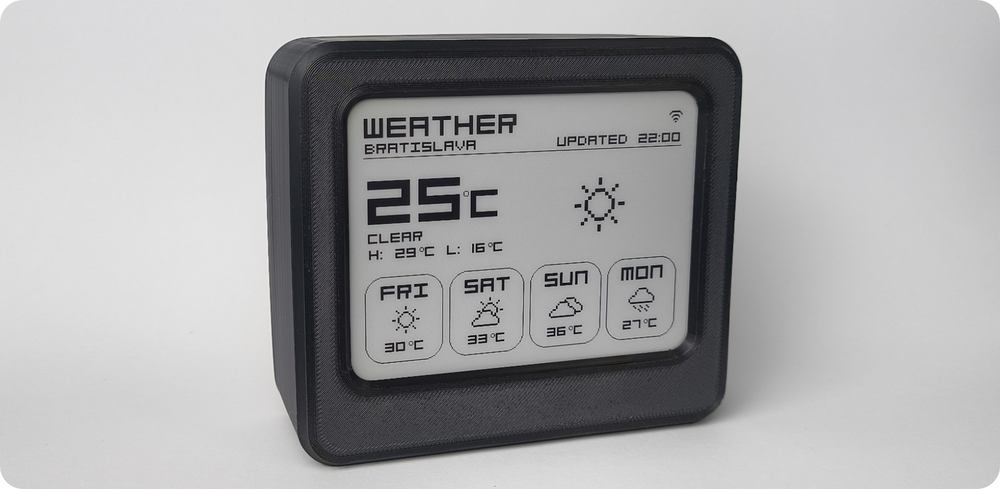

A standalone e-ink desk display built around an ESP32-C6 microcontroller, running firmware written in C++ with PlatformIO. It connects over Wi-Fi, syncs its time via NTP, and shows a clock, a task list, weather, and stock market data on a 4.2" e-ink panel, sourced from public APIs (Open-Meteo and Twelve Data). The device is configured entirely from a web page it serves over the local network.

---

## Screens

Four screens cycle on a timer, or one can be pinned, both configurable via the web page. Each shows a Wi-Fi icon in the top right corner when connected.

### Clock

Time from NTP, with the timezone chosen from the web page and daylight saving worked out automatically from it. The date line under the clock can be toggled on or off.

<p>
  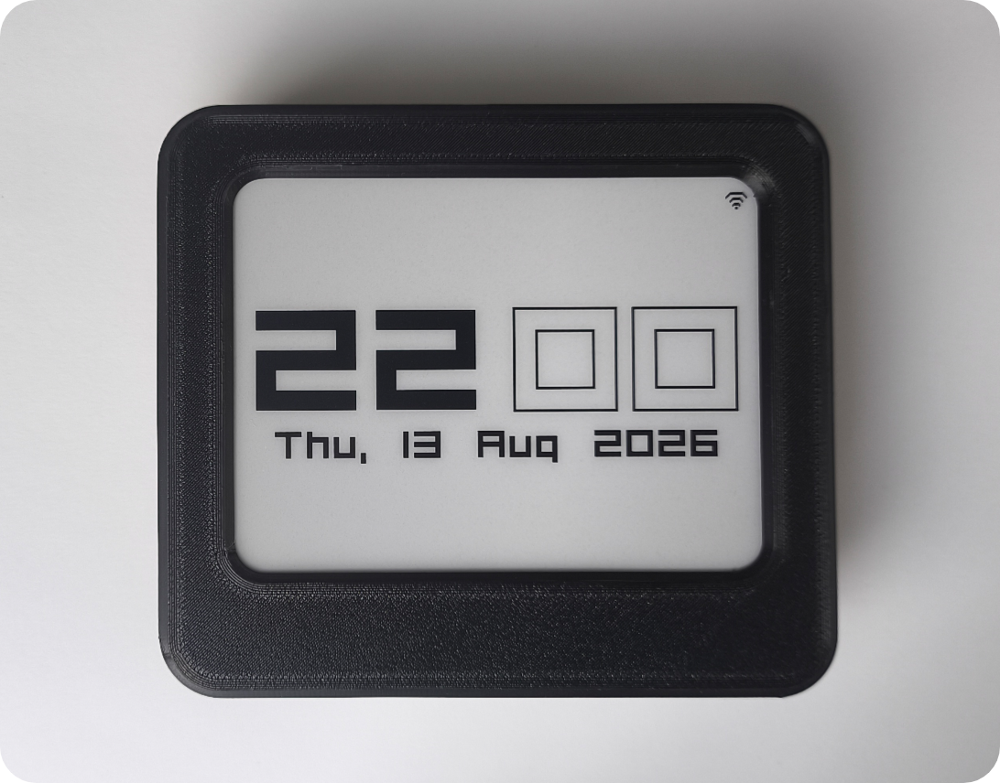
  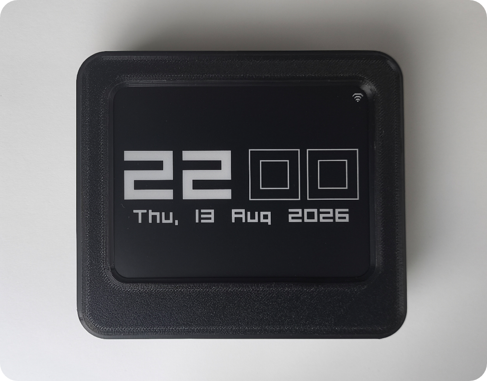
</p>

### Tasks

Five slots, edited from the web page. Shows the current date and how many entered tasks are complete. Completed tasks are struck through; deleting one closes the gap.

<p>
  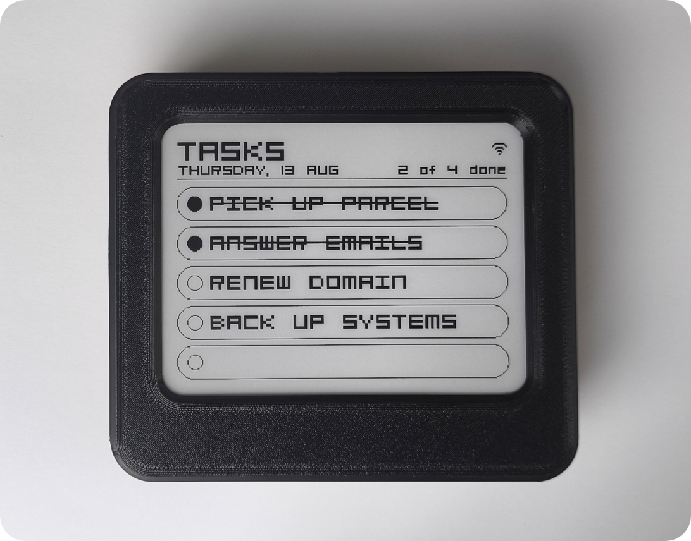
  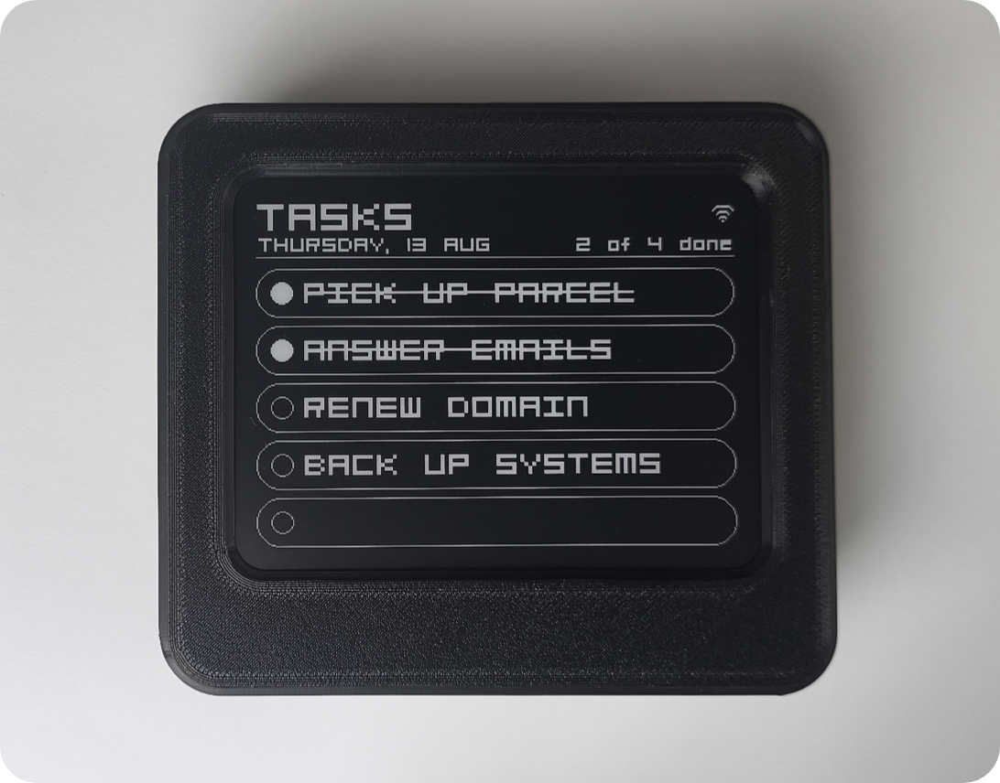
</p>

### Weather

Current conditions with a weather icon and today's high and low, plus a four-day forecast, from Open-Meteo. Location is searched by city name from the web page. No API key needed.

<p>
  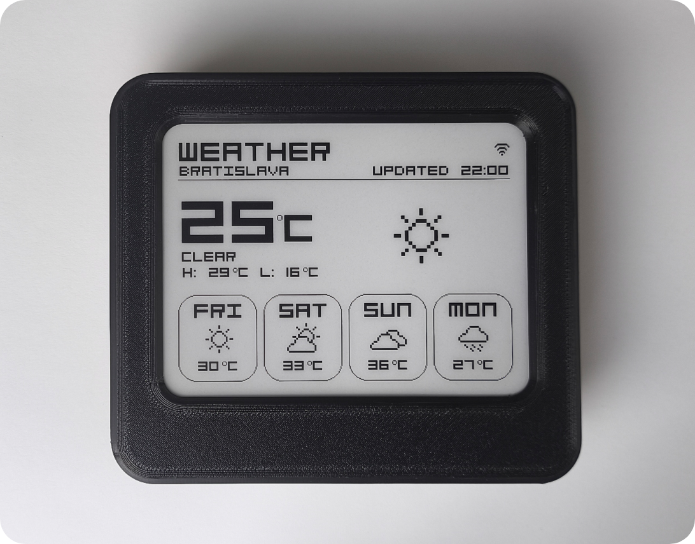
  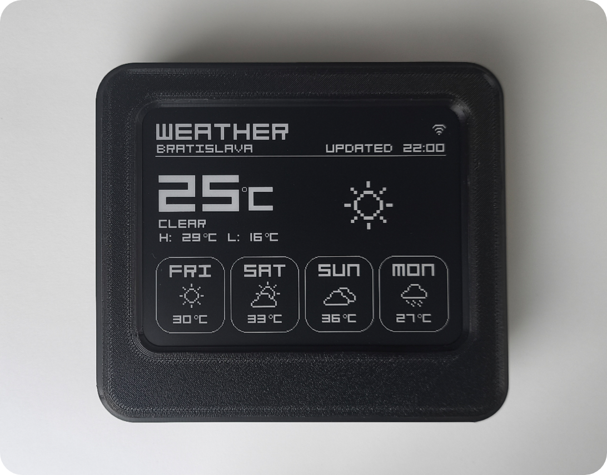
</p>

### Markets

A SPY quote with the change since the previous close, and a sparkline of the session. The header shows whether the NYSE is open or closed. SPY is fixed, chosen because ETFs are the only free tier on Twelve Data and it gives a general read on the stock market. Needs a free Twelve Data key, entered from the web page.

<p>
  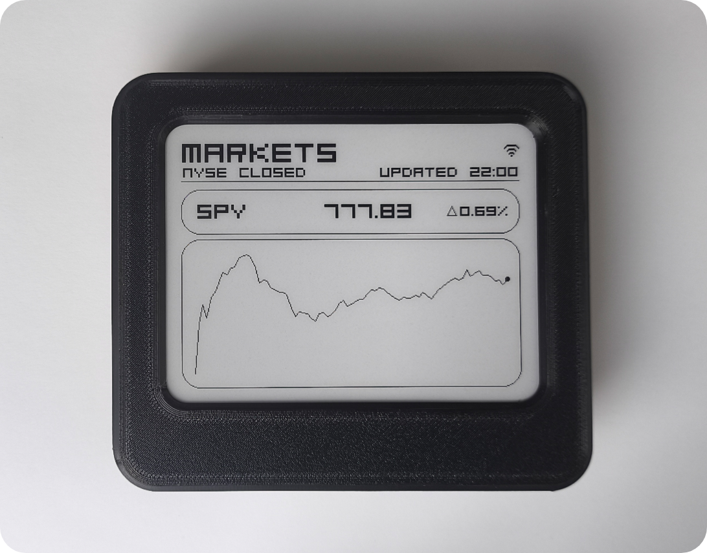
  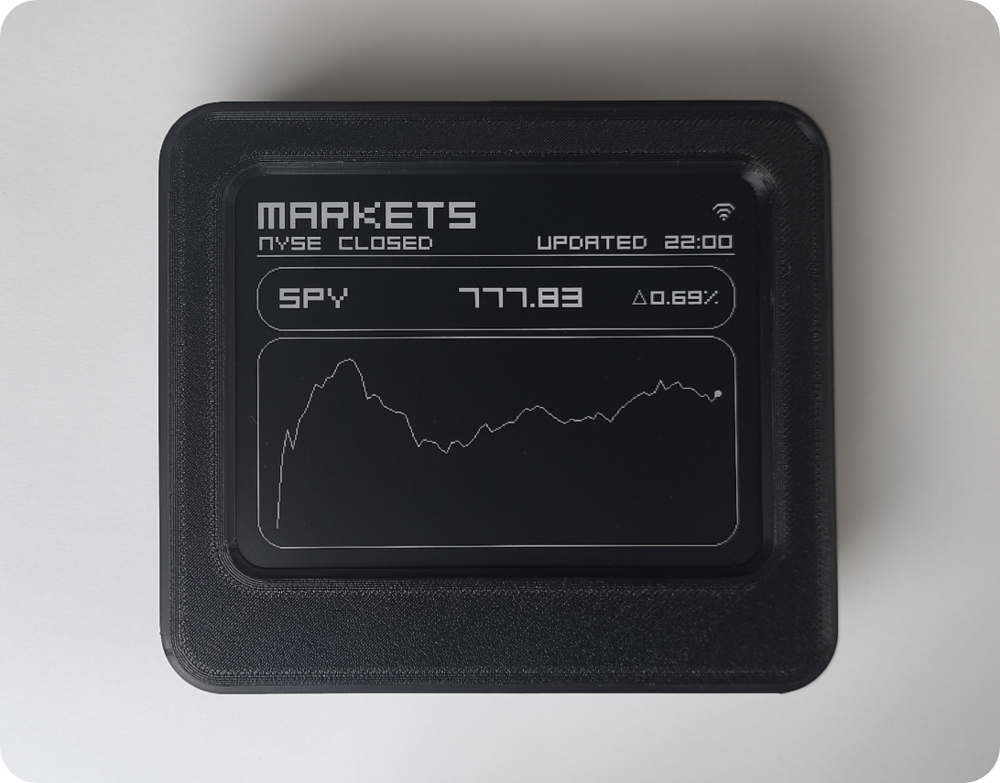
</p>

---

## Hardware

Roughly 30€ in parts including the enclosure.

| Part | Notes |
| --- | --- |
| ESP32-C6-DevKit | Any other C6 board should work without changes |
| WeAct 4.2" e-ink screen | 400x300, black and white, SSD1683 controller |
| SM5308 power module | USB-C input, charge and boost |
| 18650 li-ion cell | Used 2200mAh, size depends on desired runtime |
| 3D printed enclosure | Two .stl files modeled by me, see `enclosure/` |

<br>

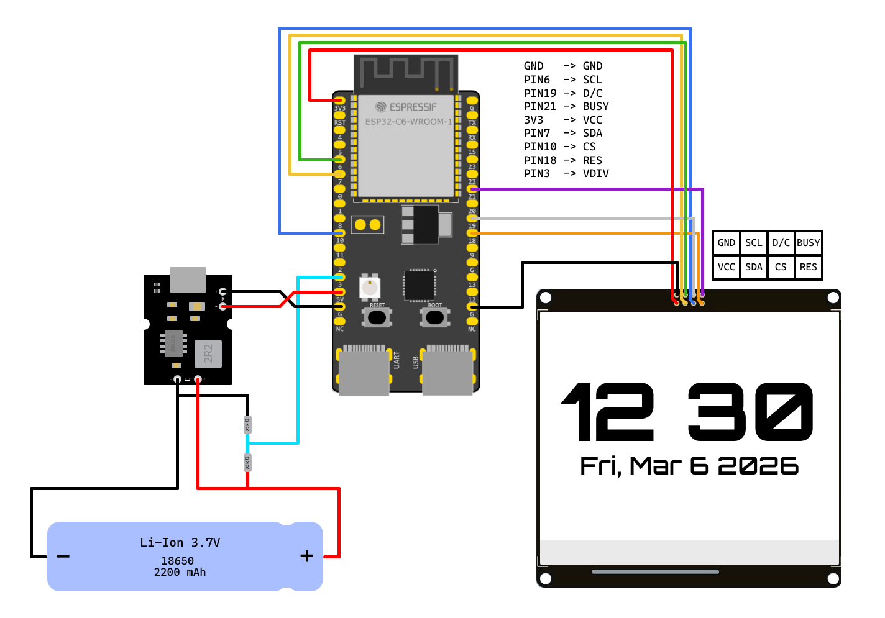
<br>


---

## Building

PlatformIO, with the [pioarduino](https://github.com/pioarduino/platform-espressif32) platform fork. The official PlatformIO only supports the ESP32C6 for ESP-IDF, but not yet for the Arduino framework this project uses.

```bash
git clone https://github.com/sidereall/eink-desk-dashboard
cd eink-desk-dashboard
cp src/secrets.h.example src/secrets.h    # then fill in your Wi-Fi details
```

Two uploads, since the firmware and the web page live in different places:

```bash
pio run -t upload      # firmware
pio run -t uploadfs    # the web page, onto the filesystem partition
```

Skipping the second step leaves the API working, but the config page returns a 404 error.

---

## Setting it up

After a successful Wi-Fi connection, the e-ink panel shows its IP address on screen. Opening that address in a browser on the same network loads the config page. From there, a "dismiss info screen" button clears the IP address from the panel. It only reappears after a reset, done by holding the BOOT button for 3 seconds on the ESP32-C6.

Each section below has a save button that pushes the change to the panel immediately. The page also reflects the device's current settings on load, so opening it from a different device still shows what's already configured, except the Twelve Data API key, which only shows whether one is set or not.

**Display** - Pin a single screen, or set to cycle through screens between 5 and 60 minutes. Toggle for dark mode.

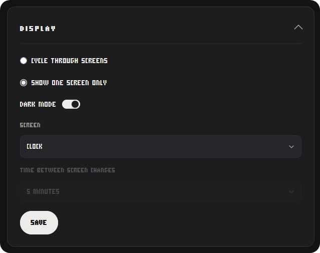

**Clock** - Time zone, and a toggle for the date line.

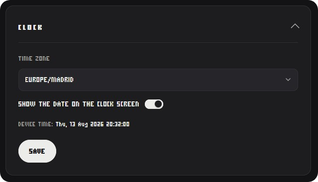

**Tasks** - The five task slots.

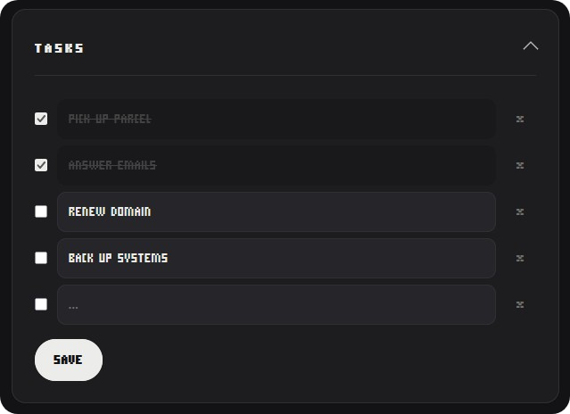

**Weather** - Weather location, searched by city name.

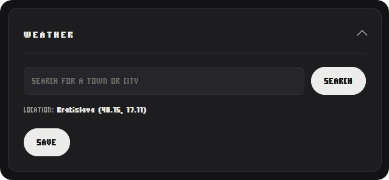

**Markets** - The Twelve Data API key.

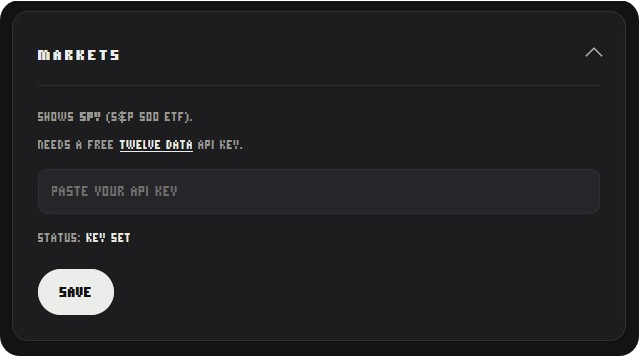

Settings are saved to flash and survive both a power cut and reflashing the firmware. A reset (holding BOOT) clears them.

---

## Project structure

```
src/
  main.cpp           |setup, the main loop, and everything that draws
  panel.cpp          |the only file that talks to the display driver
  screens.cpp        |draws each screen from a state struct
  clock_time.cpp     |NTP and the timezone rules
  tasks.cpp          |the task list, in RAM and saved to flash
  weather.cpp        |Open-Meteo fetch, on its own task
  markets.cpp        |Twelve Data fetch, on its own task
  wifi_net.cpp       |the connection and its reconnect handling
  web_ui.cpp         |the config page and its API
  app_settings.cpp   |everything that persists
  config.h           |every tunable number in the project
data/
  index.html         |the config page itself
```

---

## Security

**Protected.** Every write endpoint validates input at the boundary. Secrets never come back out: the markets key reads back only as configured or not, the Wi-Fi password exists only in the compiled firmware, and the key is logged by length alone. The radio won't join anything weaker than WPA2, so an open network with a matching name can't lure the device onto it.

**Not protected.** Any device on the same network can call the write endpoints, the same setup as most consumer devices on the LAN.

**Deliberately not done.** HTTPS would need a self-signed certificate and a browser warning on every visit, worse for the user than the problem it solves. Flash encryption is disproportionate for this scope.

---

## Future plans

- ~~Dark mode for both the panel and the web page.~~
- Fix bugs surfacing from longer-term use.
- Battery charge level monitoring.
- Choice of ETF on the markets screen, not just SPY.
- Custom PCB, replacing the current point-to-point wiring.

---
